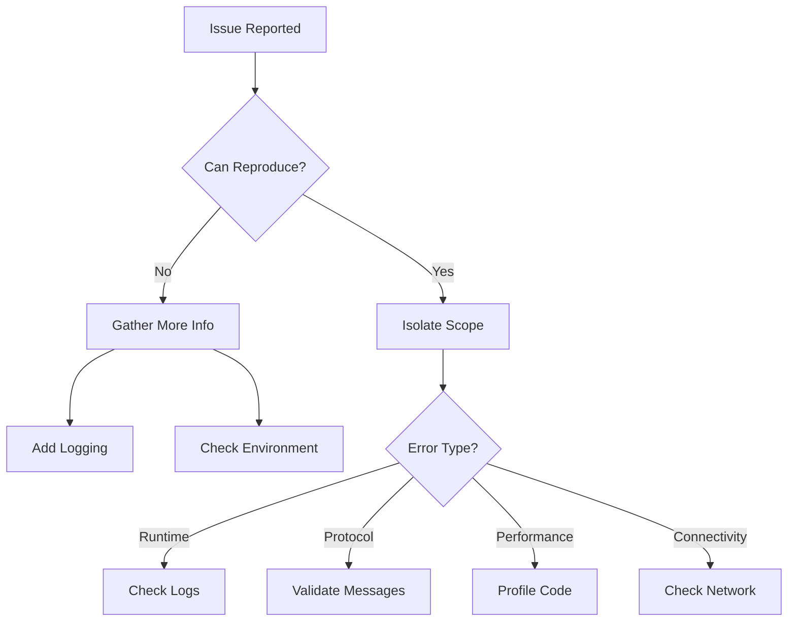

# Systematic Debugging Flowchart

## 🎯 Start Here



## 🔍 Quick Diagnosis

### 1. Immediate Checks
```bash
# Check if server is running
ps aux | grep McpServer

# Check recent logs
tail -f logs/mcp-server.log | grep ERROR

# Check port availability
netstat -an | grep 8080

# Test connectivity
curl -X POST http://localhost:8080/sse \
  -H "Content-Type: text/event-stream" \
  -d '{"jsonrpc":"2.0","id":1,"method":"initialize"}'
```

### 2. Error Categories

#### 🔴 Startup Failures
```bash
# Check configuration
cat appsettings.json | jq '.McpServer'

# Validate JSON
jq . appsettings.json > /dev/null

# Check dependencies
dotnet list package --vulnerable
dotnet list package --outdated

# Run with verbose logging
dotnet run --environment Development
```

#### 🟠 Runtime Errors
```csharp
// Add debug logging
services.AddLogging(builder =>
{
    builder.SetMinimumLevel(LogLevel.Trace);
    builder.AddConsole();
    builder.AddDebug();
});

// Enable detailed errors
builder.Services.Configure<McpServerOptions>(options =>
{
    options.EnableDetailedErrors = true;
});
```

#### 🟡 Protocol Issues
```bash
# Capture raw messages
tcpdump -i lo -A -s 0 'port 8080'

# Test with curl
curl -X POST http://localhost:8080/sse \
  -H "Content-Type: text/event-stream" \
  -H "Accept: text/event-stream" \
  --no-buffer \
  -d @test-message.json
```

## 🛠️ Debugging Tools

### Memory Issues
```csharp
// Add memory diagnostics
public class MemoryDiagnosticService : BackgroundService
{
    protected override async Task ExecuteAsync(CancellationToken ct)
    {
        while (!ct.IsCancellationRequested)
        {
            var info = GC.GetMemoryInfo();
            _logger.LogInformation("Memory: {HeapSize}MB, Gen0: {Gen0}, Gen1: {Gen1}, Gen2: {Gen2}",
                info.HeapSizeBytes / 1_048_576,
                GC.CollectionCount(0),
                GC.CollectionCount(1),
                GC.CollectionCount(2));
            
            await Task.Delay(60000, ct);
        }
    }
}
```

### Performance Profiling
```csharp
// Add timing middleware
public class TimingMiddleware
{
    public async Task InvokeAsync(HttpContext context, RequestDelegate next)
    {
        var sw = Stopwatch.StartNew();
        
        await next(context);
        
        sw.Stop();
        context.Response.Headers.Add("X-Response-Time", sw.ElapsedMilliseconds.ToString());
        
        if (sw.ElapsedMilliseconds > 1000)
        {
            _logger.LogWarning("Slow request: {Method} {Path} took {Ms}ms",
                context.Request.Method,
                context.Request.Path,
                sw.ElapsedMilliseconds);
        }
    }
}
```

### Request Tracing
```csharp
// Add correlation IDs
public class CorrelationIdMiddleware
{
    public async Task InvokeAsync(HttpContext context, RequestDelegate next)
    {
        var correlationId = context.Request.Headers["X-Correlation-ID"].FirstOrDefault()
            ?? Guid.NewGuid().ToString();
        
        context.Items["CorrelationId"] = correlationId;
        context.Response.Headers.Add("X-Correlation-ID", correlationId);
        
        using (_logger.BeginScope(new Dictionary<string, object>
        {
            ["CorrelationId"] = correlationId
        }))
        {
            await next(context);
        }
    }
}
```

## 🐛 Common Issues & Solutions

### Issue: "Connection refused"
```bash
# Check if server is listening
lsof -i :8080

# Solution 1: Port already in use
kill -9 $(lsof -t -i:8080)

# Solution 2: Firewall blocking
sudo ufw allow 8080/tcp

# Solution 3: Wrong binding
# Update appsettings.json
{
  "Kestrel": {
    "Endpoints": {
      "Http": {
        "Url": "http://0.0.0.0:8080"
      }
    }
  }
}
```

### Issue: "Method not found"
```csharp
// Debug handler registration
public class HandlerRegistry
{
    public void LogRegisteredHandlers()
    {
        foreach (var handler in _handlers)
        {
            _logger.LogInformation("Registered handler: {Method} -> {Type}",
                handler.Key,
                handler.Value.GetType().Name);
        }
    }
}
```

### Issue: "Timeout errors"
```csharp
// Add timeout diagnostics
public class TimeoutDiagnostics
{
    public async Task<T> ExecuteWithDiagnostics<T>(
        Func<CancellationToken, Task<T>> operation,
        string operationName,
        TimeSpan timeout)
    {
        using var cts = new CancellationTokenSource(timeout);
        var sw = Stopwatch.StartNew();
        
        try
        {
            return await operation(cts.Token);
        }
        catch (OperationCanceledException) when (sw.Elapsed >= timeout)
        {
            _logger.LogError("Operation {Name} timed out after {Ms}ms",
                operationName, sw.ElapsedMilliseconds);
            throw new TimeoutException($"{operationName} timed out");
        }
    }
}
```

## 📊 Debug Output Analysis

### Log Pattern Analysis
```bash
# Find error patterns
grep -E "ERROR|WARN" logs/*.log | \
  awk -F': ' '{print $2}' | \
  sort | uniq -c | sort -nr

# Track specific correlation ID
grep "CorrelationId=abc123" logs/*.log

# Find slow operations
grep -E "took [0-9]{4,}ms" logs/*.log
```

### Memory Dump Analysis
```bash
# Capture memory dump
dotnet-dump collect -p $(pgrep McpServer)

# Analyze dump
dotnet-dump analyze core_12345
> dumpheap -stat
> dumpheap -type McpServer
> gcroot <object_address>
```

## 🎬 Step-by-Step Debugging

### 1. Reproduce Issue
```csharp
[Test]
public async Task Reproduce_Issue_XYZ()
{
    // Arrange
    var server = new TestServerBuilder()
        .WithConfiguration(c => c.EnableDetailedErrors = true)
        .Build();
    
    // Act
    var response = await server.SendMessage(new
    {
        jsonrpc = "2.0",
        id = 1,
        method = "problematic_method",
        @params = new { /* params that cause issue */ }
    });
    
    // Assert - This should fail like production
    Assert.That(response.Error, Is.Not.Null);
}
```

### 2. Isolate Component
```csharp
// Test individual components
[Test]
public async Task Test_Component_In_Isolation()
{
    // Remove all dependencies
    var component = new ProblematicComponent(
        Mock.Of<ILogger<ProblematicComponent>>(),
        Mock.Of<IDependency>()
    );
    
    // Test with minimal input
    var result = await component.ProcessAsync(minimalInput);
    
    // Verify behavior
    Assert.That(result, Is.Not.Null);
}
```

### 3. Add Diagnostics
```csharp
public class DiagnosticDecorator<T> : IHandler<T>
{
    private readonly IHandler<T> _inner;
    
    public async Task<Response> HandleAsync(T request, CancellationToken ct)
    {
        var stopwatch = Stopwatch.StartNew();
        var memoryBefore = GC.GetTotalMemory(false);
        
        try
        {
            _logger.LogDebug("Starting {Handler} with {Request}",
                _inner.GetType().Name,
                JsonSerializer.Serialize(request));
            
            var response = await _inner.HandleAsync(request, ct);
            
            _logger.LogDebug("Completed {Handler} in {Ms}ms, Memory delta: {Bytes}",
                _inner.GetType().Name,
                stopwatch.ElapsedMilliseconds,
                GC.GetTotalMemory(false) - memoryBefore);
            
            return response;
        }
        catch (Exception ex)
        {
            _logger.LogError(ex, "Failed {Handler} after {Ms}ms",
                _inner.GetType().Name,
                stopwatch.ElapsedMilliseconds);
            throw;
        }
    }
}
```

## 🚑 Emergency Fixes

### Quick Patches
```csharp
// Temporary fix with feature flag
if (_configuration.GetValue<bool>("FeatureFlags:UseEmergencyFix"))
{
    // Temporary workaround
    return new Response { Success = true };
}
else
{
    // Original problematic code
}
```

### Circuit Breaker
```csharp
// Prevent cascading failures
services.AddHttpClient<IExternalService>()
    .AddPolicyHandler(GetCircuitBreakerPolicy());

static IAsyncPolicy<HttpResponseMessage> GetCircuitBreakerPolicy()
{
    return HttpPolicyExtensions
        .HandleTransientHttpError()
        .CircuitBreakerAsync(
            handledEventsAllowedBeforeBreaking: 3,
            durationOfBreak: TimeSpan.FromSeconds(30),
            onBreak: (result, duration) =>
            {
                Log.Warning("Circuit breaker opened for {Duration}", duration);
            },
            onReset: () =>
            {
                Log.Information("Circuit breaker closed");
            });
}
```

## 📝 Debug Checklist

- [ ] Issue reproduced locally
- [ ] Minimal reproduction case created
- [ ] Relevant logs collected
- [ ] Memory/CPU metrics checked
- [ ] Network traffic analyzed
- [ ] Configuration validated
- [ ] Dependencies verified
- [ ] Recent changes reviewed
- [ ] Similar issues searched
- [ ] Temporary workaround possible?