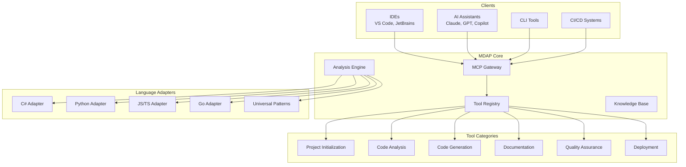

# Product Requirements Document: MCP Development Assistant Platform

## Executive Summary

The MCP Development Assistant Platform (MDAP) transforms software development by providing an AI-native, protocol-based development toolchain that works across all programming languages, frameworks, and project types. By exposing development tools through the Model Context Protocol, we enable a future where AI assistants, IDEs, and developers collaborate seamlessly through a standardized interface.

## 🎯 Vision Statement

**"Every line of code written with an AI copilot that truly understands your project."**

We envision a world where:
- New projects start with perfect AI context from day one
- Development tools are universally accessible through a standard protocol
- AI assistants can perform complex development tasks autonomously
- Code quality is maintained automatically throughout the development lifecycle
- Knowledge is preserved and transferred seamlessly between projects and teams

## 🚀 Product Overview

### What is MDAP?

MDAP is a universal development platform that exposes sophisticated development tools through the Model Context Protocol (MCP). It acts as an intelligent layer between developers, AI assistants, and development tools, providing:

1. **AI-Optimized Project Scaffolding** - Start every project with perfect context
2. **Continuous Code Intelligence** - Real-time analysis and suggestions
3. **Universal Tool Access** - Same tools work across all languages and frameworks
4. **Knowledge Preservation** - Capture and transfer expertise automatically
5. **Autonomous Development** - Enable AI to perform complex development tasks

### Core Innovation

Unlike traditional development tools that are language-specific and require manual integration, MDAP provides:
- **Protocol-based access** to all development tools
- **AI-first design** with token optimization and context management
- **Universal patterns** that work across languages
- **Cumulative learning** from all projects using the platform

## 📊 Market Opportunity

### Target Users

#### Primary: AI-Augmented Developers
- Developers using GitHub Copilot, Claude, ChatGPT, or other AI assistants
- Want to maximize AI effectiveness in their workflow
- Need consistent quality across projects
- Value automation and best practices

#### Secondary: Development Teams
- Teams adopting AI development practices
- Need standardized workflows and quality gates
- Want to preserve and share knowledge
- Require consistent architecture patterns

#### Tertiary: Enterprises
- Organizations rolling out AI development tools
- Need governance and compliance
- Want to standardize on best practices
- Require security and quality guarantees

### Market Size
- 28.7M developers worldwide (2024)
- 80% expected to use AI tools by 2025
- $10B+ AI development tools market by 2027
- Growing 40% YoY

## 🎨 Product Design

### Core Principles

1. **Universal First** - Every tool must work across languages
2. **AI Native** - Designed for AI consumption, human readable
3. **Progressive Enhancement** - Start simple, grow sophisticated
4. **Community Driven** - Patterns and tools improve through usage
5. **Privacy Focused** - All analysis happens locally by default

### Architecture



## 🛠️ Core Features

### 1. AI Context Management System

**Description**: Automatically generates and maintains optimal AI context for any project.

**Key Capabilities**:
- `.ai/` directory with structured context files
- Token-optimized summaries of large codebases
- Automatic context updates on code changes
- Multi-AI provider support (Claude, GPT, Gemini)
- Context inheritance for monorepos

**Example Usage**:
```json
{
  "tool": "ai_context_manager",
  "params": {
    "action": "initialize",
    "project_path": "./my-project",
    "ai_providers": ["claude", "github-copilot"],
    "optimization_level": "aggressive",
    "include_patterns": true
  }
}
```

### 2. Intelligent Project Scaffolding

**Description**: Creates new projects with AI-optimized structure and built-in best practices.

**Key Capabilities**:
- Template marketplace with community patterns
- Automatic pattern detection and suggestion
- Cross-language architecture patterns
- Integrated testing and CI/CD setup
- Pre-configured AI workflows

**Example Usage**:
```json
{
  "tool": "project_scaffold",
  "params": {
    "name": "user-service",
    "type": "microservice",
    "patterns": ["clean_architecture", "event_sourcing", "cqrs"],
    "language": "typescript",
    "ai_features": {
      "auto_documentation": true,
      "test_generation": true,
      "continuous_analysis": true
    }
  }
}
```

### 3. Continuous Code Intelligence

**Description**: Real-time code analysis with AI-powered insights and automatic fixes.

**Key Capabilities**:
- Multi-dimensional analysis (security, performance, architecture)
- Pattern recognition and anomaly detection
- Automatic fix generation with AI
- Incremental analysis for large codebases
- Custom rule creation through examples

**Example Usage**:
```json
{
  "tool": "code_intelligence",
  "params": {
    "mode": "continuous",
    "checks": ["security", "performance", "patterns", "complexity"],
    "auto_fix": true,
    "ai_suggestions": true,
    "severity_threshold": "medium"
  }
}
```

### 4. Knowledge Graph System

**Description**: Captures and connects development knowledge across projects and teams.

**Key Capabilities**:
- Automatic pattern extraction from code
- Decision tracking with context
- Cross-project learning
- Team knowledge sharing
- AI-queryable knowledge base

**Example Usage**:
```json
{
  "tool": "knowledge_graph",
  "params": {
    "action": "query",
    "question": "How do we typically handle authentication in microservices?",
    "context": ["current_project", "team_projects", "community"]
  }
}
```

### 5. Autonomous Development Agent

**Description**: Enables AI to perform complex, multi-step development tasks independently.

**Key Capabilities**:
- Task planning and execution
- Multi-tool orchestration
- Progress tracking and reporting
- Rollback capabilities
- Human approval workflows

**Example Usage**:
```json
{
  "tool": "dev_agent",
  "params": {
    "task": "Add user authentication to the API",
    "approach": "industry_standard",
    "constraints": ["maintain_backward_compatibility", "add_tests"],
    "approval_required": true
  }
}
```

### 6. Universal Pattern Engine

**Description**: Language-agnostic pattern recognition and application system.

**Key Capabilities**:
- Pattern learning from successful projects
- Cross-language pattern translation
- Custom pattern definition
- Pattern impact analysis
- Community pattern sharing

**Example Usage**:
```json
{
  "tool": "pattern_engine",
  "params": {
    "action": "apply",
    "pattern": "repository_pattern",
    "target": "./src/data",
    "adapt_to_language": true,
    "preserve_style": true
  }
}
```

## 📈 Success Metrics

### Developer Productivity
- **50% reduction** in project setup time
- **75% reduction** in context switching for AI development
- **40% improvement** in code quality metrics
- **90% reduction** in architectural violations

### AI Effectiveness
- **3x improvement** in AI suggestion relevance
- **80% reduction** in AI context tokens needed
- **60% increase** in successful AI task completion
- **95% accuracy** in AI-generated code

### Platform Growth
- **1M+ developers** within 18 months
- **10K+ community patterns** in marketplace
- **100+ language adapters** from community
- **$1B+ in productivity gains** measured

## 🗺️ Product Roadmap

### Phase 1: Foundation (Months 1-3)
- [ ] Core MCP server implementation
- [ ] Basic tool registry system
- [ ] 5 essential tools (init, analyze, generate, document, test)
- [ ] 3 language adapters (Python, TypeScript, Go)
- [ ] CLI client implementation

### Phase 2: AI Integration (Months 4-6)
- [ ] AI context management system
- [ ] Claude and GPT optimization
- [ ] Token usage analytics
- [ ] Pattern learning system
- [ ] VS Code extension

### Phase 3: Intelligence Layer (Months 7-9)
- [ ] Knowledge graph implementation
- [ ] Continuous analysis engine
- [ ] Autonomous development agent
- [ ] Advanced pattern recognition
- [ ] Multi-project learning

### Phase 4: Ecosystem (Months 10-12)
- [ ] Community marketplace
- [ ] Enterprise features
- [ ] Custom tool SDK
- [ ] Partner integrations
- [ ] Advanced security features

### Phase 5: Scale (Year 2)
- [ ] Global pattern database
- [ ] AI model fine-tuning
- [ ] Enterprise deployment options
- [ ] Compliance frameworks
- [ ] Advanced analytics

## 💰 Business Model

### Open Core Strategy

#### Free Tier (Community Edition)
- All core tools
- Basic AI optimizations
- Community patterns
- Local execution only
- Community support

#### Pro Tier ($29/developer/month)
- Advanced AI features
- Private pattern library
- Team knowledge sharing
- Priority support
- Advanced analytics

#### Enterprise Tier (Custom pricing)
- On-premise deployment
- Custom pattern development
- Compliance features
- SLA support
- Training and consulting

### Revenue Projections
- Year 1: $5M (10K pro users)
- Year 2: $25M (50K pro, 20 enterprise)
- Year 3: $100M (200K pro, 100 enterprise)

## 🏆 Competitive Advantages

1. **Protocol-Based Architecture** - Universal access through MCP
2. **AI-First Design** - Built for AI from the ground up
3. **Language Agnostic** - Works with any technology stack
4. **Community Network Effects** - Gets better with every user
5. **Open Source Core** - Transparent and extensible

## 🚧 Technical Requirements

### Performance
- Sub-100ms response time for analysis
- Support for 1M+ file codebases
- Real-time incremental analysis
- Minimal memory footprint
- Offline-first architecture

### Security
- All analysis runs locally by default
- End-to-end encryption for team sharing
- Zero-knowledge architecture for cloud features
- SOC2 compliance for enterprise
- Regular security audits

### Scalability
- Horizontal scaling for cloud services
- Efficient caching strategies
- CDN for pattern distribution
- Microservices architecture
- Event-driven processing

## 🎯 Success Criteria

### Year 1 Goals
- 100K+ active developers
- 1K+ community patterns
- 10+ language adapters
- 95% developer satisfaction
- Break-even on operations

### Long-term Vision (5 Years)
- De facto standard for AI development
- 10M+ active developers
- Integration with all major AI tools
- $1B+ valuation
- Fundamental shift in how software is built

## 🌟 Conclusion

The MCP Development Assistant Platform represents a paradigm shift in software development. By providing universal, AI-optimized development tools through a standard protocol, we enable a future where:

- Every developer has an AI copilot that truly understands their project
- Best practices are automatically enforced across all codebases
- Knowledge is preserved and shared seamlessly
- Development quality improves continuously through collective learning

This is not just a tools platform - it's the foundation for the next generation of software development, where humans and AI collaborate seamlessly to build better software, faster.

---

*"The best time to plant a tree was 20 years ago. The second best time is now."*

*Let's build the future of AI-augmented development together.*